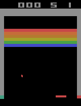
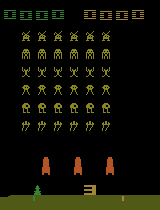
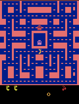
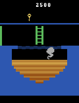
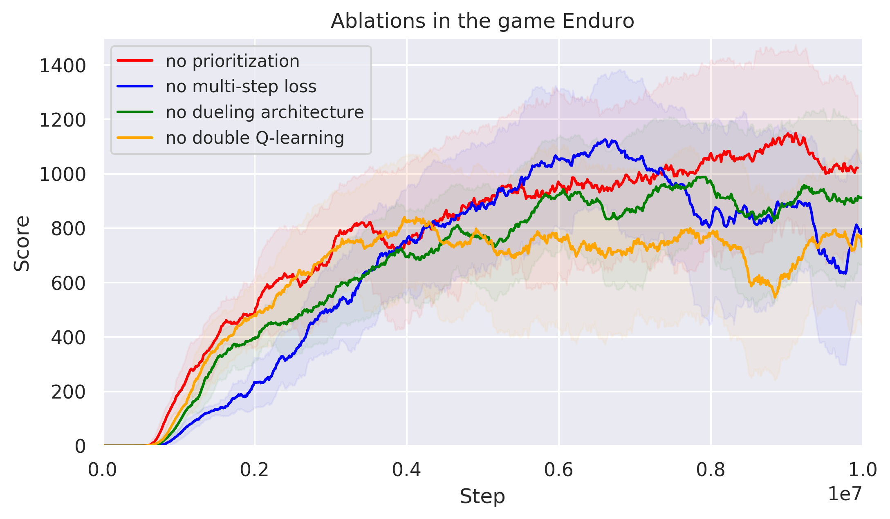

# Deep Q-Learning from Demonstrations (DQfD)
---
---

This repository contains an implementation of the learning algorithm proposed in [*Deep Q-Learning from Demonstrations* (Hester et al. 2018)](https://arxiv.org/pdf/1704.03732.pdf) for solving *Atari 2600* video games using a combination of reinforcement learning and imitation learning techniques.

Note: The implementation is part of my Bachelor's Thesis [*Tiefes Q-Lernen mit Demonstrationen*](https://ins.uni-bonn.de/media/public/publication-media/BA_Skript_Felix_Kerkhoff.pdf).

|  |  |  |
| :---: | :---: | :---: |
|  |  | |

<!--| :---: | :---: | -->

## Table of Contents
---
* [Features](#features)
<!--* [Instructions](#instructions)
    * [Dependencies](#dependencies)
    * [Installation](#installation)
    * [Usage](#usage)--> 
* [Some Experiments](#experiments)
    * [Ablations in the game *Enduro*](#enduroexp)
    * [Using demonstrations to learn *Montezuma's Revenge*](#montezumaexp)
* [Task List](#todo)
* [License](#license)

## Features 
---
* DQN (cf. [*Human-level control through deep reinforcement learning* (Mnih et al. 2015)](http://klab.tch.harvard.edu/academia/classes/BAI/pdfs/MnihEtAlHassibis15NatureControlDeepRL.pdf))
* Double DQN (cf. [*Deep Reinforcement Learning with Double Q-learning* (Van Hasselt, Guez, Silver 2015)](https://arxiv.org/pdf/1509.06461.pdf))
* PER (cf. [*Prioritized Experience Replay* (Schaul et al. 2015)](https://arxiv.org/pdf/1511.05952.pdf))
* Dueling DQN (cf. [*Dueling Network Architectures for Deep Reinforcement Learning* (Wang et al. 2016)](http://proceedings.mlr.press/v48/wangf16.pdf))
* n-step DQN (cf. [*Understanding Multi-Step Deep Reinforcement Learning: A Systematic Study of the DQN Target* (Hernandez-Garcia, Sutton 2019)](https://arxiv.org/pdf/1901.07510.pdf))
* DQfD (cf. [*Deep Q-Learning from Demonstrations* (Hester et al. 2018)](https://arxiv.org/pdf/1704.03732.pdf))

<!--## Instructions 
---
...

### Dependencies 
* Python 3
* Tensorflow 2
* gym

### Installation 
...

### Usage 
... -->

## Some Experiments 
---
### Ablations in the game *Enduro* 
In the first experiment we investigate the influence of the different components of *n-step Prioritized Dueling Double Deep Q-Learning* using the example of the game *Enduro*. We will do this by leaving out exactly one of the components and keeping all other parameters unchanged.

### Using demonstrations to learn *Montezuma's Revenge* 
Due to very sparse rewards and the need of long-term planning, *Montezuma's Revenge* is known to be one of the most difficult *Atari 2600* games to solve for deep reinforcement learning agents, such that most of them fail in this game. The use of human demonstrations might help to overcome this issue:

**Note**: The figures show the number of steps (i.e. the number of decisions made by the agent) on the x-axis and the scores achieved during the training process on the y-axis. The learning curves are smoothed using the moving average over intervals of 50 episodes and the shaded areas correspond to the standard deviance within these intervals.

## Task List 
---
* [x] binary sum tree for fast proportional sampling
* [x] Cython implementation of PER for memory efficient and fast storage and sampling of experiences
* [x] DQN implementation (in TensorFlow 2 syntax) with an optional dueling network architecture and the possibility to use a combination of the following losses:
    * single-step Q-Learning loss
    * multi-step Q-Learning loss
    * large margin classification loss (cf. [*Boosted Bellman Residual Minimization Handling Expert Demonstrations* (Piot, Geist, Pietquin 2014)](http://www.lifl.fr/~pietquin/pdf/ECML_2014_OPMGBP.pdf))
    * L2-regularization loss
* [x] Q-learning agent including the learning algorithm
* [x] logger for the documentation of the learning process
* [x] environment preprocessing
* [x] loading and preprocesing of human demonstration data using the Atari-HEAD data set (cf. [*Atari-HEAD: Atari Human Eye-Tracking and Demonstration Dataset* (Zhang et al. 2019)](https://arxiv.org/pdf/1903.06754.pdf)) as resource
* [ ] function to use a pretrained model as demonstrator
* [ ] agent wrapper
* [ ] more advanced exploration strategies
* [ ] argparse function for command-line parameter selection
* [ ] random seed control for better reproducibility
* [ ] agent evaluation as suggested in [*The Arcade Learning Environment: An Evaluation Platform for General Agents* (Bellemare et al. 2013)](https://arxiv.org/pdf/1207.4708.pdf) for better comparability

## License 
---
This project is licensed under the terms of the [MIT license](LICENSE.md).

Copyright (c) 2020 Felix Kerkhoff

